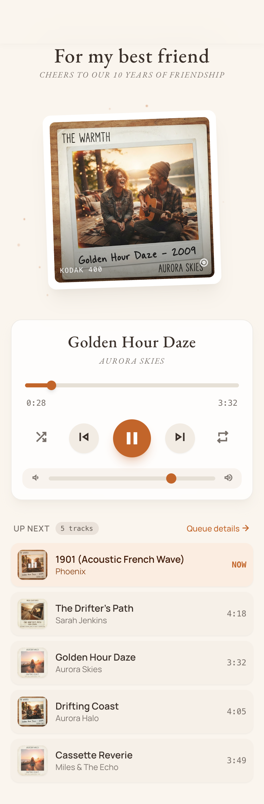
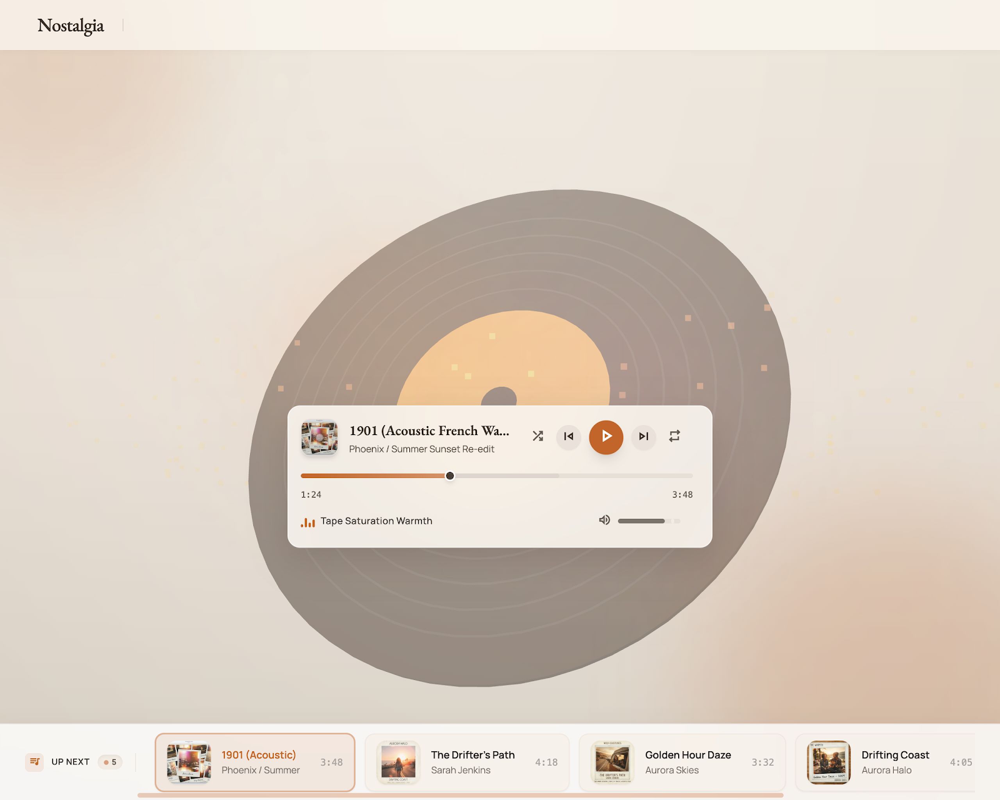

# Nostalgia — a personalised music page

A one-page YouTube music player you configure privately and share as a public
link. One person (the owner) sets the songs, the photo and the background
behind a secret URL; anyone with the plain link gets a read-only player.

Built as a digital mixtape — not a streaming dashboard.

|  |  |
|---|---|
|  |  |
| **Mobile** — polaroid, stacked player, vertical queue | **Desktop** — centred stage, floating player, bottom queue strip |

---

## Build guide

**[docs/build-guide.html](docs/build-guide.html)** walks through the whole thing
end to end — the two design prompts, what to put in `SPEC.md`, the commands to
run it locally, deploying to Netlify, and what to do with it once it is live.
Open the file in a browser.

## How this was made

The project went design-first, in three stages.

### 1. Design generated from prompts

Two prompts were written for **Google Flow** and run separately, producing the
two reference screenshots in [`design/`](design). Both prompts are kept in this
repo, verbatim:

- **[Desktop design prompt](docs/prompts/desktop-design-prompt.md)** → `design/desktop.png`
- **[Mobile design prompt](docs/prompts/mobile-design-prompt.md)** → `design/mobile.png`

They were deliberately run as **two separate prompts**, not one responsive
brief. That decision shaped everything downstream: desktop is not a widened
mobile layout, so the app ships two distinct layout trees that share one player.

Both prompts fix the same visual language — warm ivory ground, burnt orange
`#C96322` accent, editorial serif for display type, clean sans for controls,
monospace for timings.

### 2. Spec written from the designs

[`SPEC.md`](SPEC.md) turns the two screenshots into a buildable brief: data
model, API surface, both layouts, player behaviour, the settings panel, device
constraints, and a build order. It also records the non-obvious traps — the
YouTube thumbnail letterboxing problem, why reordering is array order and not a
sort field, why a wrong edit key must render the public page rather than an
error.

### 3. Built in the spec's own order

`SPEC.md` §11 prescribes the sequence, and it was followed:

| Step | | |
|---|---|---|
| 1 | Config type, default config, Blobs read/write, `/api/config` | done |
| 2 | Mobile layout, fed by config | done |
| 3 | YouTube IFrame API + custom transport, wired into mobile | done |
| 4 | Desktop layout, reusing the same player controller | done |
| 5 | `/api/youtube` and the Music tab | done |
| 6 | `/api/upload` and the Appearance tab | done |
| 7 | Publish flow and success screen | done |
| 8 | Empty and error states, polish on both layouts | done |

Steps 1–3 were finished and verified before step 4 started, on purpose: the
player is the part most likely to need iteration, and iterating on it twice
across two layouts is wasted work. **Step 4 added no player logic at all.**

---

## Running it

```bash
npm install
echo 'EDIT_KEY=pick-something-long-and-random' > .env.local
npm run dev
```

- **Public page:** `/`
- **Settings mode:** `/?edit=<EDIT_KEY>`

| Command | |
|---|---|
| `npm run dev` | dev server |
| `npm run build` | production build |
| `npm test` | queue, formatting and YouTube-parsing tests |
| `npm run typecheck` | `tsc --noEmit` |

### Netlify Blobs locally

`getStore` configures itself from the environment on Netlify. Off Netlify it
throws, so `npm run dev` falls back to writing under `.netlify/blobs-local/`.
Run `netlify dev`, or set `NETLIFY_SITE_ID` + `NETLIFY_API_TOKEN`, to exercise
real Blobs. Production never takes the fallback — a misconfigured deploy fails
loudly instead of writing to a container filesystem that disappears.

### Environment variables

| Variable | Required | Purpose |
|---|---|---|
| `EDIT_KEY` | yes | Settings-mode passcode. Make it long and random — it is the only thing protecting writes, and there is no rate limiting on guesses. |
| `YOUTUBE_API_KEY` | no | Enables real track durations. Without it, durations come back `null` and the UI shows `--:--` until the player reports one. |

---

## Using it

Open `/?edit=<EDIT_KEY>` and a gear appears top-right.

**Music tab** — paste any YouTube link and press Add. `watch?v=`, `youtu.be/`,
`/shorts/`, `/embed/`, extra query params, or a bare 11-character ID all work.
Title and artist arrive automatically and stay editable. Reorder with ↑ ↓,
delete with an inline Yes/No. A private, deleted or embedding-disabled video is
reported when you add it, not after you have shared the link.

**Appearance tab** — separate mobile (portrait) and desktop (landscape)
backgrounds, an overlay-darkness slider, a dark/light text toggle, the polaroid
photo with a drag-to-position square crop, and the caption, title and subtitle
fields.

**Publish** — nothing saves until you press it. Every edit previews live on the
page behind the panel; closing with unsaved changes warns first. The success
screen gives you the shareable link **with `?edit=` stripped out**, so handing
someone the link does not hand them edit access.

---

## Stack

Next.js (App Router) + TypeScript · Tailwind CSS v4 · Netlify Blobs ·
sharp for image processing · YouTube IFrame API. No database, no auth provider,
no external UI library.

```
src/lib/          types, validation, config store, Blobs wrapper, image processing
src/player/       the single player controller, shared by both layouts
src/settings/     draft config, settings panel, both tabs, publish flow
src/components/   presentational pieces; mobile/ and desktop/ hold each layout
docs/prompts/     the Google Flow prompts that generated the designs
design/           the reference screenshots those prompts produced
```

### The player is not forked per layout

`PlayerProvider` owns every piece of playback state and the one `YT.Player`
instance. Layouts are pure presentation reading from `usePlayer()`.

The iframe lives in a DOM node React does not render. The IFrame API *replaces*
the element it is handed, so a React-owned host would leave React holding a
detached node and would destroy the player whenever the active layout changed.
Instead the container is created imperatively and moved between layout slots
that register through `registerSlot()`.

Both layouts render on the server and are gated with CSS, so the page never
flashes the wrong one and nothing sniffs the user agent. Only the iframe's slot
is chosen client-side, which is invisible because playback starts paused.
Crossing 1024px moves the one live player between slots — verified: one iframe,
same instance id, before and after.

### Edits are a draft until Publish

`ConfigProvider` holds `saved` and `draft` separately. The page renders `draft`,
so every change previews live behind the panel, and nothing reaches the store
until Publish. Warns on close and on tab unload.

### Uploaded images

Served through `/api/images/<id>.webp`. Netlify Blobs are not addressable from a
browser, so that route reads the blob and streams it. Names are nanoids and the
route enforces the pattern, so a crafted name cannot reach another key.

---

## Decisions worth knowing

- **Thumbnails are built from the video ID**, never taken from oEmbed's
  `thumbnail_url` — that one is `hqdefault.jpg`, 4:3 with black bars baked into
  the image. `maxresdefault` is missing for plenty of uploads, so `<Thumbnail>`
  falls back to `mqdefault` on error. Both are true 16:9.
- **The polaroid's inner window is 16:9**, not the near-square of the reference
  screenshot. A square window would letterbox every video — the same artefact
  the spec rejects for thumbnails.
- **A wrong `?edit=` key renders the public page byte-for-byte**, no error. An
  error message would tell a stranger they found the right parameter name.
- **Sliders are native range inputs**, so touch, mouse and keyboard all work
  without custom pointer handling. They are 44px tall for the tap target with
  the 6px track painted centred.
- **Reordering is array order**, no `order` field — a separate integer drifts
  out of sync the first time something is deleted mid-list.
- **`/api/youtube` is auth-gated**, which the spec does not require. Left open,
  the deploy is a free YouTube metadata proxy for anyone who finds the link.
- **oEmbed answers 400, not 404, for a video that does not exist.** The spec
  predicts 401/404. Without handling 400, a dead link reads to the owner as a
  transient YouTube outage and they retry it forever.
- **Uploads are validated by decoding, not by extension.** A text file renamed
  to `.jpg` and sent as `image/jpeg` is rejected when sharp fails to read it.
- **The text theme is suggested, not imposed.** Upload samples mean luminance to
  pick dark or light text; the owner can override it immediately after.
- **The desktop video card sizes off viewport height**, not just width. At
  1440×900 it is 640px as the spec asks; at 700px tall it shrinks to ~453px so
  the stage keeps fitting between the top bar and the pinned queue strip.
- **The control card overlaps the video card's padding, never the iframe.**
  Measured clearance is 4px at every tested viewport.
- **Queue wheel and arrow scrolling use `behavior: 'instant'`, not `'auto'`.**
  The scroller sets `scroll-behavior: smooth` in CSS and `'auto'` defers to it,
  which makes rapid wheel input feel laggy. Smooth is kept for the
  scroll-into-view on track change, which drops to instant under
  `prefers-reduced-motion` — a JS smooth scroll ignores the CSS rule.
- **The decorative vinyl disc was removed** after the build, by request. The
  desktop stage now sits on the plain warm gradient. `SPEC.md` §5b still
  describes it; the code is the source of truth here.

---

## Not yet verified

Real playback could not be exercised in the sandboxed browser used during the
build — it blocks YouTube media, including a direct `postMessage` to the iframe.
Verified instead: the iframe mounts inside the polaroid and the desktop stage at
16:9, visible and unobscured, with `autoplay=0`; queue advancement is covered by
unit tests.

**Play, pause, seek, volume, auto-advance on track end and the dead-link skip
still want a pass in a real browser.**

The settings panel was driven programmatically rather than by hand: add track,
inline error, reorder, inline delete confirm, background upload, photo crop,
publish, and the unsaved-changes warning were each exercised and checked. What
that cannot cover is feel — drag latency on the cropper, and whether the panel
holds up with the on-screen keyboard open on a real phone.

One desktop behaviour is proven by mechanism rather than by animation, because a
backgrounded browser pane produces no animation frames: the smooth
scroll-into-view on track change. The identical call with `behavior: 'instant'`
lands the card exactly in view and does not scroll the page vertically, so the
wiring is right — but it wants a real-browser look.

---

## Out of scope

No accounts, no multiple pages per deploy, no playlists, no comments, no
analytics, no MP3 upload or self-hosted audio.
